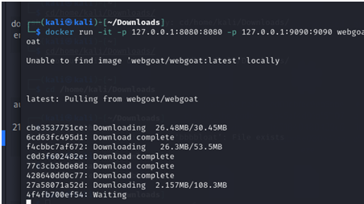
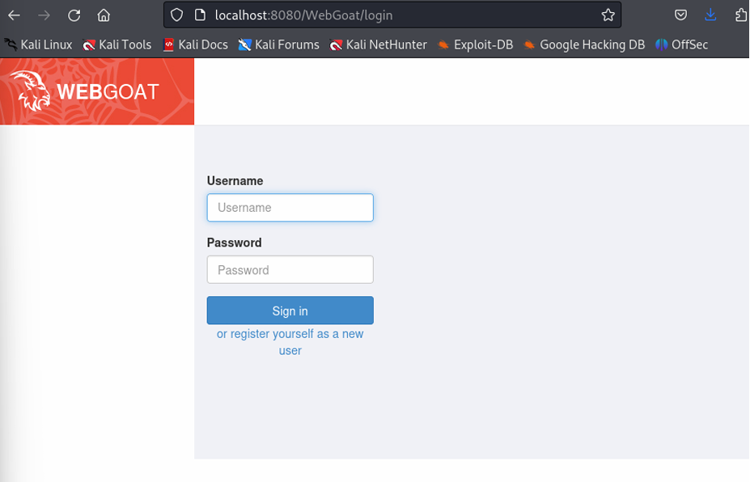
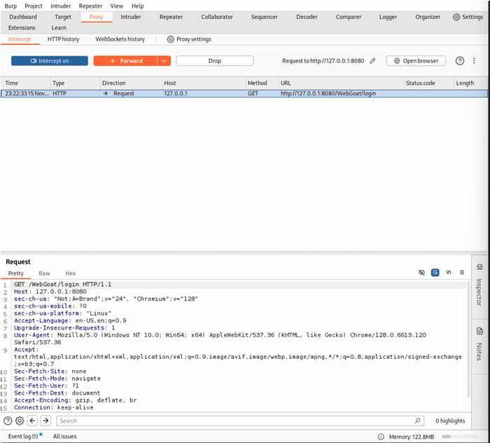
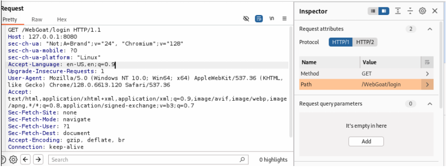

# Learning Web Application Security with Burp Suite & WebGoat

### 🎯 Objective
This project demonstrates **web-application penetration testing** using **OWASP WebGoat** and **Burp Suite**.  
WebGoat is a deliberately insecure application for learning and practicing OWASP Top-10 vulnerabilities.  
Burp Suite acts as an **intercepting proxy**, enabling inspection, modification, and replay of HTTP traffic between client and server.

---

## 🧰 Tools & Environment

| Tool | Purpose |
|------|----------|
| **WebGoat (OWASP)** | Vulnerable training web application |
| **Burp Suite Community Edition** | Web proxy and vulnerability testing framework |
| **Docker Desktop / Kali Linux** | Containerized deployment and analysis environment |
| **Browser (Chromium / Firefox)** | Used to interact with the application via localhost |

---

## ⚙️ Step 1 – Setting Up WebGoat via Docker

```bash
docker run -it -p 127.0.0.1:8080:8080 -p 127.0.0.1:9090:9090 webgoat/webgoat
````

This pulls and runs the latest WebGoat image locally on ports 8080 (WebGoat) and 9090 (WebWolf).


*Fig 1.1 – Docker build and image download for WebGoat container*

Once the container starts, the terminal displays the Spring Boot startup log and the WebGoat ASCII banner.


*Fig 1.2 – WebGoat successfully initialized inside Docker container*

---

## 🌐 Step 2 – Accessing WebGoat Application

Open the browser and navigate to:

```
http://localhost:8080/WebGoat
```

Login using default credentials:

* **Username:** admin
* **Password:** admin


*Fig 2.1 – WebGoat login portal running on localhost*

---

## 🔍 Step 3 – Configuring Burp Suite Proxy

1. Launch **Burp Suite**.
2. Set the browser proxy to `127.0.0.1:8080`.
3. Enable **Intercept On** to capture requests between browser and server.

This allows Burp Suite to intercept, analyze, and manipulate HTTP traffic in real time.


*Fig 3.1 – Burp Suite intercepting the initial GET request to WebGoat login endpoint*

---

## 🧾 Step 4 – Inspecting HTTP Requests

After intercepting traffic, the request details appear under **Proxy → HTTP History**.

* The browser sent a GET request to `/WebGoat/login`.
* Burp Suite displayed HTTP headers such as User-Agent, Accept-Language, and Cookie.
* This visibility helps test for authentication and session handling flaws.


*Fig 4.1 – Burp Inspector view showing captured GET request headers and path / WebGoat/login*

---

## 🧪 Step 5 – Login Attempt and POST Interception

* An invalid login was attempted to generate a **POST** request.
* Burp Suite captured the form data (username & password) before it reached the server.
* Parameters could then be modified to simulate attacks such as SQL Injection or Credential Brute Force.


*Fig 5.1 – Captured POST request for WebGoat login authentication test*

---

## 🧩 Findings & Insights

| Test                     | Observation                                                                    |
| ------------------------ | ------------------------------------------------------------------------------ |
| **GET Request Analysis** | Revealed endpoint structure (`/WebGoat/login`) and header information          |
| **POST Interception**    | Captured credentials and demonstrated modification capability                  |
| **Proxy Inspection**     | Verified client-server communication for authentication process                |
| **Learning Outcome**     | Understood how Burp Suite acts as a man-in-the-middle tool for ethical testing |

---

## 💡 Recommendations

1. **Input Validation & Sanitization** – Prevent SQL Injection and XSS.
2. **Multi-Factor Authentication** – Add secondary verification for login pages.
3. **Secure Session Management** – Protect against session fixation and hijacking.
4. **Regular Penetration Testing** – Audit applications periodically for emerging vulnerabilities.

---

## 🧠 Summary

This lab provided hands-on experience in ethical hacking and web-security assessment using Burp Suite and WebGoat.
You learned how to:

* Intercept and modify HTTP requests.
* Analyze traffic flows in real time.
* Identify authentication and input validation flaws.
* Apply defensive recommendations for secure web development.

WebGoat served as a controlled training platform, while Burp Suite provided a powerful toolset for dynamic application testing and analysis.

---

## 🧑‍💻 Author

**Devika Kishor**
Master’s Student in Cybersecurity | Florida Institute of Technology


